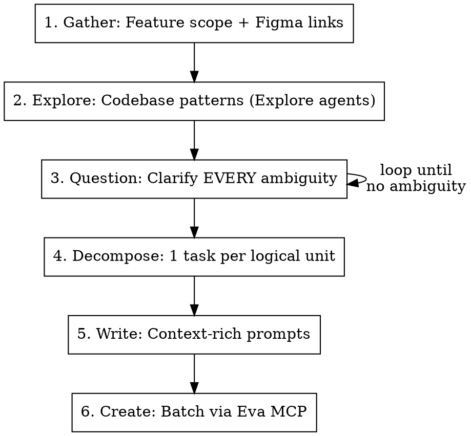

# Create Eva Tasks

## Overview

Break a feature into granular, context-rich tasks for the Eva orchestrator (`mcp__claude_ai_Eva__create_tasks_batch`). Each task prompt must be **self-contained** — the executing agent starts fresh with no prior context.

## When to Use

- User has a multi-screen feature to build (often with Figma links)
- User wants to queue tasks for overnight/autonomous execution
- User says "create tasks", "break this into tasks", "set up Eva tasks"

## Process



### 1. Gather

Collect from user:

- Feature description (what, why, where in app)
- Figma links (verify ALL are unique — duplicate node IDs is the #1 mistake)
- Route/path in the app
- Whether backend is needed or frontend-only with mock data
- Execution mode: sequential or has dependencies

### 2. Explore

Launch 1-2 Explore agents to understand:

- **Existing page/component patterns** — find the closest existing feature to copy from
- **Shared components** — what's reusable (modals, tables, tabs, navigation)
- **Data patterns** — how data flows (Convex queries? Server components? Client state?)
- **Theme/styling** — color tokens, spacing, component defaults
- **File structure** — where new files should live

The goal: find the "reference implementation" — the existing feature most similar to what's being built.

### 3. Question

Ask the user until ZERO ambiguity remains. Common gaps:

- Which tab/sidebar section does this live under?
- What happens on state transitions? (e.g., resolved → moves to which tab?)
- What constitutes a conflict/error/edge case?
- Is this frontend-only (mock data) or needs backend?
- Does the orchestrator support dependencies or only sequential?

### 4. Decompose

Break into tasks following these rules:

**Task 0 is always Foundation** — route, navigation, types/mock data, placeholder component. Every other task depends on this.

**1 task per Figma node** where possible. Combine only when:

- Two designs are states of the same component AND one is trivially small (e.g., success notification is 5 lines)
- A design only makes sense in context of another (loading → success are both the import modal)

**Identify the dependency chain** — which tasks can only run after others complete?

**Each task must be independently verifiable** — after it runs, something visible has changed.

### 5. Write Prompts

Each prompt MUST include these sections:

```markdown
# Task N: Title

**Figma**: [link with correct unique node ID]

## Context

What this feature is. What previous tasks built. What this task adds.
2-3 sentences max.

## Skills to invoke

Before writing ANY code, invoke these skills in order:

1. `skill-name` (why)
2. `skill-name` (why)

## Figma

How to fetch the design (MCP tool name, fileKey, nodeId).

## What to build

### 1. [Component/file to create or modify]

[Exact file path]

- Behavioral spec (what it does, not just what it looks like)
- Props/types
- State management approach
- What's wired vs what's stubbed for later tasks

### 2. [Next component...]

## Reference files to read first

- `path/to/file.tsx` — what pattern to follow
- `path/to/theme.ts` — tokens to use

## Do NOT

- [Project-specific constraints from CLAUDE.md]
- [Scope constraints — don't build X, that's Task N+1]
```

**Critical details in every prompt:**

- **Exact file paths** to create AND modify
- **Which existing file to copy the pattern from** (the reference implementation)
- **Type definitions** — spell them out, don't let agents invent incompatible types
- **What's stubbed** — "View Details does nothing yet — wired in Task 6"
- **Skills to invoke** — list the project's relevant skills by name
- **"Do NOT" section** — include CLAUDE.md constraints + scope limits

### 6. Create Tasks

Use `mcp__claude_ai_Eva__create_tasks_batch` to create all tasks in a single call:

```ts
{
  repoName: "org/repo",           // from `git remote get-url origin`
  app: "web",                     // monorepo app — determine from feature location (web, eprocurement, etc.)
  projectTitle: "Feature Name",   // groups tasks in Eva UI
  tasks: [
    { title: "Feature 0: Foundation", description: "..." },
    { title: "Feature 1: Dashboard", description: "..." },
    // ...all tasks in execution order
  ]
}
```

**Determine `app`** from where the feature lives:

- `apps/web/` → `"web"`
- `apps/eprocurement/` → `"eprocurement"`
- Cross-app → omit `app`, specify paths in each task prompt

Tasks array order = execution order. Eva runs them sequentially.

**Fallback:** If `create_tasks_batch` is unavailable, use `mcp__claude_ai_Eva__create_task` per task — create in dependency order, batch independent ones in parallel calls.

## Common Mistakes

| Mistake                                      | Fix                                                                                         |
| -------------------------------------------- | ------------------------------------------------------------------------------------------- |
| Thin prompts ("implement this Figma design") | Include context, file paths, behavioral specs, skills, constraints                          |
| Duplicate Figma node IDs                     | Verify every nodeId is unique before writing prompts                                        |
| No shared types across tasks                 | Task 0 defines ALL types in a single mockData.ts; later tasks import from it                |
| No reference pattern                         | Find the most similar existing feature; every prompt should say "follow the pattern from X" |
| Missing skill references                     | Check available skills list; include relevant ones in every prompt                          |
| Agent invents backend code                   | Add "Do NOT create backend code" if frontend-only                                           |
| No stub instructions                         | Every task must say what's wired and what's left for later                                  |
| Forgetting CLAUDE.md constraints             | Copy key constraints (no `any`, no comments, etc.) into Do NOT section                      |

## Quick Reference: Prompt Template

```
# Task N: [Title]
**Figma**: [unique link]

## Context
[What + what came before + what this adds]

## Skills to invoke
[Ordered list with reasons]

## Figma
[MCP fetch instructions: tool, fileKey, nodeId]

## What to build
[Numbered sections with exact file paths, behavioral specs, props/types]

## Reference files to read first
[Paths with 1-line descriptions]

## Do NOT
[CLAUDE.md constraints + scope limits]
```
