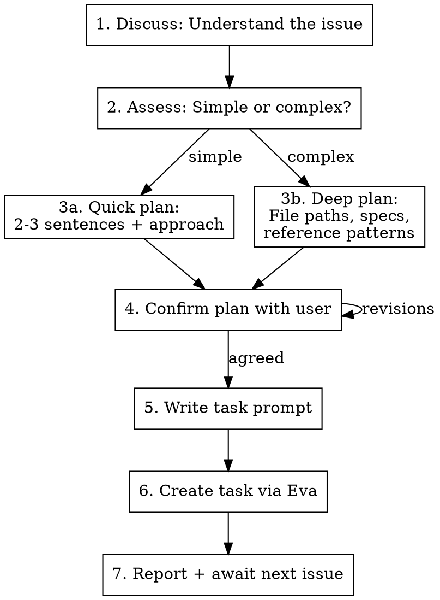

# Plan Tasks Session

Start a conversational task-planning session. The user brings issues one at a time; for each, discuss → plan → create task via Eva. Goal: end session with multiple queued tasks ready for overnight execution.

## Session Start

1. Launch 1-2 Explore agents to understand the codebase: architecture, key patterns, file structure, shared components, data layer. This context is reused for ALL tasks in the session.
2. Resolve the repo name using `mcp__claude_ai_Eva__list_repos` once upfront.
3. Tell the user: "Ready. Bring your first issue."
4. Track task count internally. After each task is created, report: "Task N created. [title]. What's next?"

## Per-Issue Flow



### 1. Discuss

Ask clarifying questions until the issue is fully understood:

- What's the problem / what needs to happen?
- Where in the app does this live?
- Any constraints or dependencies?
- Is this frontend, backend, or both?

### 2. Assess Complexity

**Simple** (quick plan): config change, small bug fix, straightforward feature addition, copy/style tweak
**Complex** (deep plan): new feature with multiple components, architectural change, cross-cutting concern, anything touching 3+ files

### 3. Plan

**Quick**: 2-3 sentence description + approach. Reference relevant files from the upfront exploration.

**Deep**: Include file paths, behavioral specs, reference patterns, skills to invoke, "Do NOT" constraints — similar to create-eva-tasks prompt quality.

### 4. Confirm

Present the plan to the user. Revise until they agree. Do NOT create the task until the user confirms.

### 5. Write Task Prompt

The task prompt must be **self-contained** — the executing agent has no prior context.

Every task prompt includes:

- What to do and why
- Relevant file paths from the upfront exploration
- Approach agreed in discussion
- Reference files / patterns to follow
- Constraints from CLAUDE.md (no `any`, no `as`, no comments, etc.)
- Skills to invoke if applicable

### 6. Create Task

Call `mcp__claude_ai_Eva__create_task` with:

- `title`: Short descriptive title
- `description`: The full self-contained task prompt
- `repoName`: Resolved at session start
- `app`: If monorepo, determined at session start

### 7. Report + Next

Print: **"Task [N] created: [title]. What's next?"**

If user says done / no more / that's it → print session summary:

```
Session complete. [N] tasks queued:
1. [title]
2. [title]
...
Ready for overnight execution.
```

## Rules

- Never create a task without user confirmation on the plan
- Never skip the upfront codebase exploration
- Reuse codebase context across all issues — don't re-explore unless user mentions a part of the codebase not covered
- Keep the conversation natural — this is a chat, not a rigid form
- Adapt plan depth to complexity — don't over-specify simple tasks
